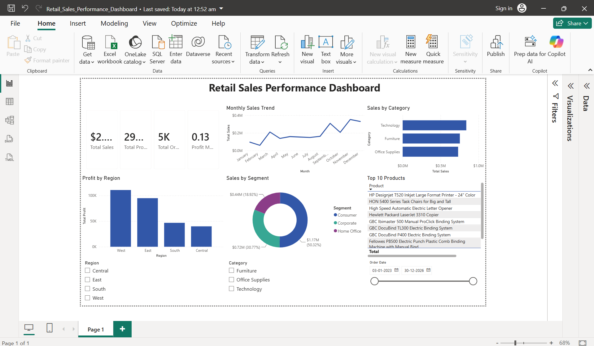

# 📊 Retail Sales Performance Dashboard | Power BI


---

## 📌 Project Overview

The **Retail Sales Performance Dashboard** is an interactive Business Intelligence solution developed using **Power BI** to analyze retail sales data. The dashboard enables users to monitor key business metrics, identify sales trends, compare regional performance, and analyze product categories through dynamic visualizations and interactive filters.

---

## 🎯 Objectives

- Analyze retail sales performance.
- Track monthly sales and profit trends.
- Compare sales across categories and regions.
- Monitor important KPIs.
- Enable interactive business analysis using slicers.

---

# 📷 Dashboard Preview

> Add your dashboard screenshot below.



---

# 📈 Dashboard Features

### 📌 KPI Cards

- 💰 Total Sales
- 💵 Total Profit
- 📦 Total Orders
- 📊 Profit Margin

---

### 📉 Visualizations

- 📈 Monthly Sales Trend
- 📊 Sales by Category
- 📍 Profit by Region
- 🍩 Sales by Segment
- 📋 Top Products Table

---

### 🎛 Interactive Filters

- Region
- Category
- Order Date

---

# ⚙ Data Preparation

The dataset was transformed using **Power Query** by:

- Cleaning raw sales records
- Standardizing category values
- Standardizing region names
- Correcting data types
- Removing inconsistencies

---

# 🧮 DAX Measures

```DAX
Total Sales =
SUM(Orders[Sales])

Total Profit =
SUM(Orders[Profit])

Total Orders =
DISTINCTCOUNT(Orders[Order ID])

Total Quantity =
SUM(Orders[Quantity])

Profit Margin % =
DIVIDE([Total Profit],[Total Sales],0)

Average Order Value =
DIVIDE([Total Sales],[Total Orders],0)
```

---

# 📂 Dataset

- Sample Superstore Dataset
- Format: Excel (.xlsx)

---

# 🛠 Tools & Technologies

| Tool | Purpose |
|------|----------|
| Power BI Desktop | Dashboard Development |
| Power Query | Data Cleaning |
| DAX | KPI Calculations |
| Microsoft Excel | Dataset |
| GitHub | Version Control |

---

# 📊 Dashboard Insights

- Technology generated the highest sales.
- West region achieved the highest profit.
- Consumer segment contributed the largest share of sales.
- Sales showed consistent growth during the final quarter.
- Interactive filters allow dynamic exploration of business performance.

---

# 📁 Project Structure

```
Retail-Sales-Performance-Dashboard
│
├── Retail_Sales_Performance_Dashboard.pbix
├── Sample_Superstore.xlsx
├── README.md
└── Screenshots
      └── Dashboard.png
```

---

# 🚀 How to Use

1. Download the repository.
2. Open **Retail_Sales_Performance_Dashboard.pbix** using Power BI Desktop.
3. Refresh the dataset if required.
4. Explore the dashboard using slicers and interactive visuals.

---

# 💡 Skills Demonstrated

- Business Intelligence
- Data Analysis
- Dashboard Design
- Data Cleaning
- Power Query
- DAX
- Data Visualization
- KPI Reporting
- Sales Analysis

---

# 📌 Future Enhancements

- Forecast future sales trends
- Customer segmentation analysis
- Product profitability dashboard
- Inventory performance tracking
- Sales forecasting using AI visuals

---

# 👩‍💻 Author

**Harshini**

MCA Student | Aspiring Data Analyst

GitHub: https://github.com/harshinimk13

---
